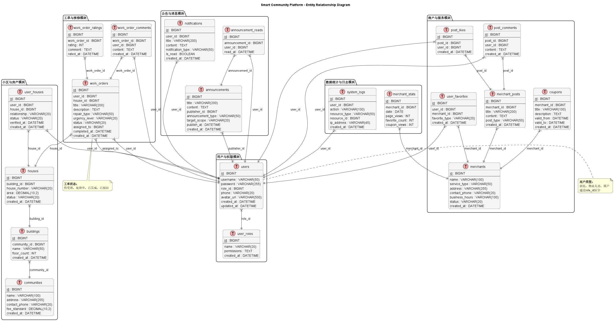

# smart-community-platform: 功能与数据设计

## 一 完整功能点设计

### （一）居民端（微信小程序）

#### 账号与房产绑定
- 微信授权登录：关联微信账号，自动获取昵称、头像（脱敏处理），无需额外注册
- 房产绑定：填写小区名称、楼栋号、房号，上传房产证 / 购房合同照片（可选），提交物业审核
- 身份验证：物业审核通过后，激活账号社区权限；支持家庭成员添加（需主账号授权）
- 账号设置：修改密码、绑定手机号、设置消息通知偏好（如公告、工单进度是否推送微信模板消息）

#### 物业交互功能
- 公告查看：按 "全部公告""紧急通知（停水 / 停电）""活动通知" 分类展示，标记已读 / 未读，支持搜索历史公告
- 报修服务：
  - 发起报修：选择报修类型（家电维修、水电故障、公共区域问题等），上传故障照片 / 视频，设置紧急程度（紧急 / 一般 / 低），填写补充说明
  - 工单跟踪：查看报修单状态（待受理 / 处理中 / 已完成 / 已驳回）、处理人员、预计完成时间，支持向物业发起留言询问
  - 评价反馈：工单完成后，对服务质量（1-5 星）、处理效率打分，填写文字评价
- 信息查询：查看小区基本信息（物业联系方式、物业费缴费标准）、个人房产关联信息（如建筑面积、物业费欠费状态）

#### 商户服务功能
- 商户浏览：按 "便民服务（洗衣 / 维修）""餐饮外卖（仅展示，无交易）""商超零售" 分类展示周边商户，支持按距离、评分排序
- 商户详情：查看商户服务介绍、营业时间、门店照片、联系方式，支持一键拨打商户电话
- 优惠查看：浏览商户发布的纯信息类优惠券（如 "持小程序界面到店享 9 折"），支持收藏优惠券
- 商户动态：查看商户发布的新品到店、今日特价等动态，支持点赞、评论（可选）
- 商户收藏：收藏常用商户，在 "我的收藏" 中快速访问

#### 个人中心功能
- 我的工单：展示所有报修工单历史，支持筛选（待处理 / 已完成）、查看详情
- 我的收藏：汇总收藏的商户、优惠券，支持取消收藏
- 消息中心：接收工单进度通知、公告提醒、商户动态推送，支持标记已读、删除消息
- 满意度问卷：定期弹出短问卷（如使用报修功能后），收集对平台的满意度反馈

### （二）物业端（Web 管理后台）

#### 系统管理
- 小区配置：添加 / 编辑小区信息（名称、地址、物业费标准、物业联系方式），配置楼栋、单元、房屋数据（支持批量导入）
- 角色与权限：创建物业员工账号，分配角色（管理员 / 客服 / 维修工），设置权限（如客服仅能处理工单，管理员可配置小区信息）
- 公告模板：预设公告类型模板（停水通知、活动通知），减少重复编辑工作
- 系统日志：查看所有操作日志（如谁修改了工单状态、谁发布了公告），支持按时间、操作人筛选

#### 居民管理
- 账号审核：查看居民提交的房产绑定申请，审核通过 / 驳回（需填写驳回理由）
- 居民列表：查看已激活的居民账号，关联房产信息、联系方式，支持搜索、导出列表
- 家庭成员管理：查看居民添加的家庭成员，支持驳回不合规的家庭成员关联

#### 工单管理
- 工单接收：查看居民提交的报修单，按紧急程度、提交时间排序，标记 "待受理" 工单
- 工单分配：将待受理工单派给指定维修工，支持批量分配，可添加分配备注（如 "该住户需周末上门"）
- 状态更新：维修工完成维修后，审核其提交的 "处理结果"（如上传维修照片），更新工单为 "已完成"；若需居民补充信息，可驳回至 "待居民补充"
- 工单统计：按时间（日 / 周 / 月）、报修类型、处理人员统计工单数量，展示 "平均响应时间""平均完成时间" 等指标（可视化图表）

#### 公告管理
- 公告发布：选择公告类型，编辑内容（支持插入图片），指定推送范围（全体居民 / 特定楼栋 / 特定房号），设置是否推送微信模板消息
- 公告跟踪：查看已发布公告的 "24 小时阅读率"（去重）、阅读人数，支持撤回错误公告
- 历史公告：归档所有已发布公告，支持搜索、删除

#### 数据看板
- 运营数据：展示居民激活率（绑定房号用户 / 总家庭数）、工单处理效率（平均响应时间、完成率）、公告触达率
- 服务质量：展示居民对工单的平均评分、好评率（4 星及以上占比），支持按处理人员筛选
- 导出报表：将数据看板中的指标导出为 Excel，用于月度 / 季度总结

### （三）商户端（Web 管理后台）

#### 商户入驻与管理
- 入驻申请：填写商户基本信息（名称、地址、营业执照照片、联系方式），选择服务类型，提交物业审核
- 资料编辑：审核通过后，编辑服务介绍（支持插入图片）、营业时间，更新门店照片
- 账号设置：修改密码、绑定手机号，设置动态发布权限（如是否允许员工发布动态）

#### 服务与动态管理
- 优惠发布：创建纯信息类优惠券，设置优惠内容（如 "到店享 8 折"）、有效期，上传优惠券图片
- 动态发布：发布新品到店、今日特价等动态，支持插入图片、视频，设置动态可见范围（仅本小区居民）
- 内容管理：查看已发布的优惠、动态，支持编辑、删除，统计 "优惠查看次数""动态点赞数"

#### 数据统计
- 曝光数据：查看店铺主页的 "7 天 / 30 天访问人次""新增收藏数"，支持按日期筛选
- 优惠效果：统计优惠券的 "查看次数""到店核销次数（商户手动录入）"
- 数据导出：将曝光数据、优惠效果数据导出为 Excel，用于调整服务展示策略

### （四）系统支撑功能（跨角色）

#### 消息通知
- 微信模板消息：工单状态变更（如 "您的报修单已派单"）、公告推送（如 "停水通知已发布"）自动触发
- 小程序内消息：若微信模板消息无法使用（如无企业资质），在小程序 "消息中心" 同步展示通知，标记未读
- 消息日志：记录所有消息的发送状态（成功 / 失败），失败时自动重试（3 次上限）

#### 数据安全与权限
- 权限控制：基于 RBAC（角色权限控制），限制不同角色的数据访问范围（如居民仅能查看自己的工单，维修工仅能查看自己负责的工单）
- 敏感数据加密：居民手机号、家庭住址等敏感信息存储时加密，前端仅展示部分内容（如手机号隐藏中间 4 位）
- HTTPS 传输：所有前端与后端的交互采用 HTTPS 协议，防止数据传输过程中泄露
- 防重放攻击：对核心 API（如工单状态修改）添加签名机制，防止请求被重复提交

#### 第三方集成
- 微信登录集成：居民端通过微信小程序登录 API 获取用户唯一标识，关联平台账号
- 对象存储集成：居民上传的报修照片、商户上传的门店照片，存储至阿里云 OSS（或同类服务），前端通过 URL 访问
- 缓存服务：使用 Redis 缓存高频访问数据（如小区基础信息、热门商户列表），提升系统响应速度

## 二 完整数据表设计

### 👨‍👩‍👧‍👦 用户与权限相关表

#### users（用户表）
| 字段名 | 类型 | 说明 |
|:-------|:-----|:-----|
| id | bigint | 主键 |
| openid | varchar(64) | 微信 OpenID（居民端） |
| username | varchar(64) | 用户名（物业/商户） |
| password_hash | varchar(255) | 密码哈希（物业/商户） |
| phone | varchar(20) | 手机号（加密存储） |
| avatar_url | varchar(255) | 头像 URL |
| role_id | int | 角色id |
| is_active | boolean | 是否激活 |
| created_at | datetime | 创建时间 |
| updated_at | datetime | 更新时间 |
| is_deleted | boolean | 是否删除 |
| deleted_at | datetime | 删除时间 |

#### user_roles（角色权限表）
| 字段名 | 类型 | 说明 |
|:-------|:-----|:-----|
| id | int | 主键 |
| name | varchar(32) | 角色名（admin,客服,维修工） |
| role_type | enum('property','merchant','resident') | 角色类型 |
| permissions | json | 权限列表（菜单+操作） |
| created_at | datetime | 创建时间 |

### 🏠 小区与房产相关表

#### communities（小区表）
| 字段名 | 类型 | 说明 |
|:-------|:-----|:-----|
| id | bigint | 主键 |
| name | varchar(100) | 小区名称 |
| address | varchar(200) | 地址 |
| property_phone | varchar(20) | 物业电话 |
| fee_standard | decimal(10,2) | 物业费标准（元/平米） |
| created_at | datetime | 创建时间 |

#### buildings（楼栋表）
| 字段名 | 类型 | 说明 |
|:-------|:-----|:-----|
| id | bigint | 主键 |
| community_id | bigint | 小区ID |
| name | varchar(32) | 楼栋名称（如1栋） |
| unit_count | int | 单元数 |

#### houses（房屋表）
| 字段名 | 类型 | 说明 |
|:-------|:-----|:-----|
| id | bigint | 主键 |
| building_id | bigint | 楼栋ID |
| unit | varchar(10) | 单元号 |
| number | varchar(10) | 房号 |
| area | decimal(8,2) | 建筑面积 |
| owner_name | varchar(64) | 业主姓名 |

#### user_houses（用户房产绑定表）
| 字段名 | 类型 | 说明 |
|:-------|:-----|:-----|
| id | bigint | 主键 |
| user_id | bigint | 用户ID |
| house_id | bigint | 房屋ID |
| relationship | enum('owner','family') | 关系（业主/家庭成员） |
| status | enum('pending','approved','rejected') | 审核状态 |
| certificate_image | varchar(255) | 房产证照片URL |
| approved_by | bigint | 审核人（物业用户ID） |
| approved_at | datetime | 审核时间 |

### 📢 公告与消息表

#### announcements（公告表）
| 字段名 | 类型 | 说明 |
|:-------|:-----|:-----|
| id | bigint | 主键 |
| community_id | bigint | 小区ID |
| title | varchar(200) | 标题 |
| content | text | 内容 |
| type | enum('emergency','activity','normal') | 类型 |
| target_type | enum('all','building','house') | 推送范围类型 |
| target_ids | json | 目标楼栋/房号ID列表 |
| publisher_id | bigint | 发布人ID |
| is_published | boolean | 是否发布 |
| published_at | datetime | 发布时间 |
| created_at | datetime | 创建时间 |

#### announcement_reads（公告已读表）
| 字段名 | 类型 | 说明 |
|:-------|:-----|:-----|
| id | bigint | 主键 |
| announcement_id | bigint | 公告ID |
| user_id | bigint | 用户ID |
| read_at | datetime | 阅读时间 |

### 🔧 工单与报修表

#### work_orders（工单表）
| 字段名 | 类型 | 说明 |
|:-------|:-----|:-----|
| id | bigint | 主键 |
| user_id | bigint | 报修用户ID |
| house_id | bigint | 房产ID |
| type | varchar(32) | 报修类型 |
| description | text | 问题描述 |
| images | json | 图片URL列表 |
| urgency | enum('high','medium','low') | 紧急程度 |
| status | enum('pending','processing','completed','rejected','waiting_resident') | 工单状态 |
| assigned_to | bigint | 指派给（维修工ID） |
| assigned_at | datetime | 指派时间 |
| expected_finish_at | datetime | 预计完成时间 |
| completed_at | datetime | 实际完成时间 |
| reject_reason | text | 驳回原因 |
| resident_supplement | text | 居民补充信息 |
| created_at | datetime | 创建时间 |
| updated_at | datetime | 更新时间 |

#### work_order_comments（工单留言表）
| 字段名 | 类型 | 说明 |
|:-------|:-----|:-----|
| id | bigint | 主键 |
| work_order_id | bigint | 工单ID |
| user_id | bigint | 留言用户ID |
| content | text | 留言内容 |
| created_at | datetime | 创建时间 |

#### work_order_ratings（工单评价表）
| 字段名 | 类型 | 说明 |
|:-------|:-----|:-----|
| id | bigint | 主键 |
| work_order_id | bigint | 工单ID |
| service_rating | int(1) | 服务质量（1-5） |
| efficiency_rating | int(1) | 处理效率（1-5） |
| comment | text | 评价内容 |
| created_at | datetime | 评价时间 |

### 🏪 商户与服务表

#### merchants（商户表）
| 字段名 | 类型 | 说明 |
|:-------|:-----|:-----|
| id | bigint | 主键 |
| user_id | bigint | 关联用户ID |
| name | varchar(100) | 商户名称 |
| service_categories | ENUM('REPAIR_SERVICE', 'LIFE_SERVICE', 'RETAIL_STORE', 'FOOD_BEVERAGE') | 服务分类 |
| address | varchar(200) | 地址 |
| phone | varchar(20) | 联系电话 |
| business_hours | varchar(100) | 营业时间 |
| description | text | 服务介绍 |
| images | json | 门店照片URL列表 |
| status | enum('pending','approved','rejected') | 入驻状态 |
| approved_by | bigint | 审核人ID |
| approved_at | datetime | 审核时间 |
| created_at | datetime | 创建时间 |

#### coupons（优惠券表）
| 字段名 | 类型 | 说明 |
|:-------|:-----|:-----|
| id | bigint | 主键 |
| merchant_id | bigint | 商户ID |
| title | varchar(100) | 优惠标题 |
| description | text | 优惠内容 |
| image_url | varchar(255) | 优惠图片 |
| start_date | date | 开始日期 |
| end_date | date | 结束日期 |
| view_count | int | 查看次数 |
| created_at | datetime | 创建时间 |
| updated_at | datetime | 更新时间 |

#### merchant_posts（商户动态表）
| 字段名 | 类型 | 说明 |
|:-------|:-----|:-----|
| id | bigint | 主键 |
| merchant_id | bigint | 商户ID |
| title | varchar(200) | 动态标题 |
| content | text | 动态内容 |
| images | json | 图片列表 |
| like_count | int | 点赞数 |
| created_at | datetime | 创建时间 |

#### user_favorites（用户收藏表）
| 字段名 | 类型 | 说明 |
|:-------|:-----|:-----|
| id | bigint | 主键 |
| user_id | bigint | 用户ID |
| target_type | enum('merchant','coupon') | 收藏类型 |
| target_id | bigint | 收藏目标ID |
| created_at | datetime | 创建时间 |
| updated_at | datetime | 更新时间 |

#### post_likes（动态点赞表）
| 字段名 | 类型 | 说明 |
|:-------|:-----|:-----|
| id | bigint | 主键 |
| user_id | bigint | 用户ID |
| post_id | bigint | 动态ID |
| created_at | datetime | 点赞时间 |

#### post_comments（动态评论表）
| 字段名 | 类型 | 说明 |
|:-------|:-----|:-----|
| id | bigint | 主键 |
| user_id | bigint | 用户ID |
| post_id | bigint | 动态ID |
| content | text | 评论内容 |
| created_at | datetime | 评论时间 |

### 📊 数据统计与日志表

#### merchant_stats（商户统计表）
| 字段名 | 类型 | 说明 |
|:-------|:-----|:-----|
| id | bigint | 主键 |
| merchant_id | bigint | 商户ID |
| date | date | 统计日期 |
| page_views | int | 页面访问量 |
| favorite_count | int | 收藏次数 |
| coupon_views | int | 优惠券查看次数 |
| created_at | datetime | 创建时间 |

#### system_logs（系统日志表）
| 字段名 | 类型 | 说明 |
|:-------|:-----|:-----|
| id | bigint | 主键 |
| user_id | bigint | 操作用户ID |
| action | varchar(100) | 操作描述 |
| resource_type | varchar(50) | 资源类型 |
| resource_id | bigint | 资源ID |
| ip_address | varchar(45) | IP地址 |
| user_agent | text | 用户代理 |
| created_at | datetime | 操作时间 |

### 📨 消息通知表

#### notifications（消息通知表）
| 字段名 | 类型 | 说明 |
|:-------|:-----|:-----|
| id | bigint | 主键 |
| user_id | bigint | 接收用户ID |
| title | varchar(200) | 消息标题 |
| notification_type | enum('work_order','announcement','merchant_post','system') | 消息种类 |
| content | text | 消息内容 |
| related_id | bigint | 关联业务ID |
| is_read | boolean | 是否已读 |
| sent_via | enum('app','sms','wechat') | 发送渠道 |
| sent_status | enum('pending','sent','failed') | 发送状态 |
| created_at | timestamp | 创建时间 |

## E-R 图

